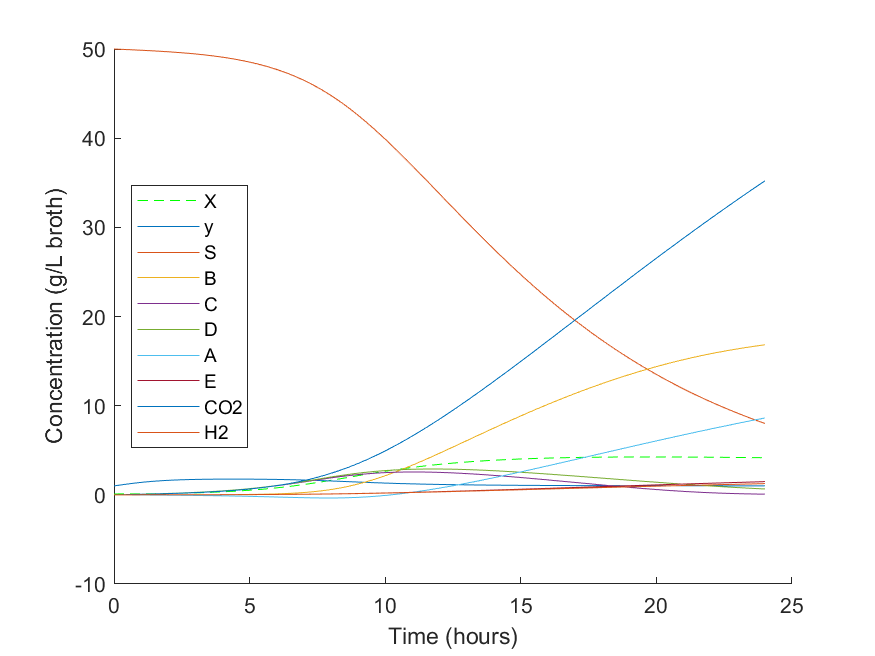
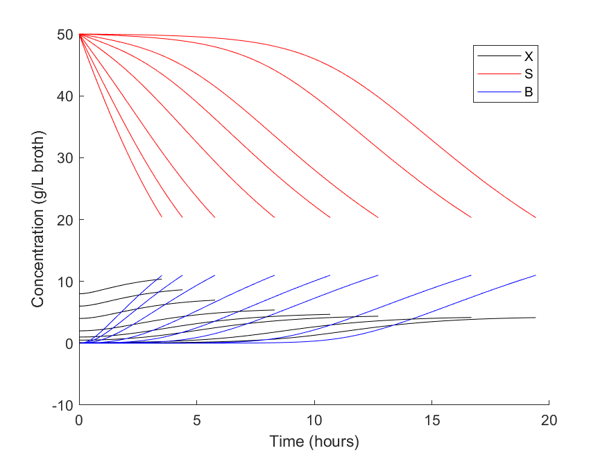

# biobutanol-reaction-kinetics-modelling

Modelling of batch fermentation producing glucose from biomass via acetone-butanol-ethanol fermentation with *C. Acetobutylicum*.

Model results:

Sensitivity analysis with respect to starting biomass concentration:

